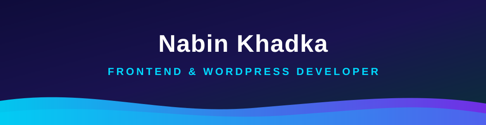
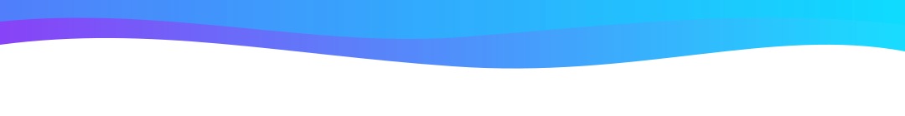

 

  

## 👋 About Me

Hi, I'm **Nabin Khadka** from **Tehrathum, Nepal**, a **Frontend & WordPress Developer** who turns designs into fast, beautiful, and memorable web experiences. As the site says: I build *"interfaces that feel premium at first click."*

I'm self-driven and always curious. I craft **100% responsive, fluid layouts** (from 320px up to ultra-wide displays) with semantic **HTML5**, modern **CSS3** (Grid/Flexbox + system variables), and high-performance **vanilla JavaScript** with no bulky dependencies. On the WordPress side, I blend the design power of **Elementor with ACF and custom code** into fast, secure, scalable websites, including custom Gutenberg blocks and tailored PHP/CSS.

<table width="100%">
<tr>
<td width="50%" valign="top">

- 🎯 **100% Responsive & Fluid**: pixel-perfect from 320px to ultra-wide displays
- 🚀 **Performance-first**: clean, bloat-free builds targeting 100/100 Core Web Vitals

</td>
<td width="50%" valign="top">

- 🧩 **WordPress powered**: Elementor, ACF & tailored PHP/CSS for custom, data-driven sites
- 🌏 **Open to work**: available for remote freelance projects and collaborations

</td>
</tr>
</table>

## 🛠️ My Tech Stack

### Languages

  

 

### WordPress Ecosystem

  

## 📦 Projects

Real repos from my profile: languages and last-commit badges update automatically.

<table width="100%">
<tr>
<td width="50%" valign="top">

**🩺 [Web Health Doctor](https://github.com/Nabinkdk7/web-health-doctor)**\
Chrome extension (MV3) that diagnoses any page on demand: DOM health, Core Web Vitals (LCP/CLS/INP), SEO, accessibility, responsiveness & tech stack, with a deep-debug suite and audit report exports. Runs 100% locally.

</td>
<td width="50%" valign="top">

**💬 [Nepali Quotes](https://github.com/Nabinkdk7/Nepali-Quotes)**\
500+ handpicked Nepali quotes on love, life & motivation: clean UI, one-click copy, favorites, and fast bilingual (EN/NP) search.

</td>
</tr>
<tr>
<td width="50%" valign="top">

**☕ [Nabin Coffee Responsive Site](https://github.com/Nabinkdk7/Responsive-Coffee-Web)**\
Mobile-first, fully responsive single-page site for a coffee shop in Kathmandu. Built with semantic HTML & CSS.

</td>
<td width="50%" valign="top">

**⌚ [Responsive Watch Website](https://github.com/Nabinkdk7/Responsive-Watch-website)**\
A performance-first, mobile-friendly showcase for watch brands: collections, pricing, and features laid out in an engaging structure.

</td>
</tr>
<tr>
<td width="50%" valign="top">

**🍽️ [Responsive Food Restaurant Website](https://github.com/Nabinkdk7/Responsive-Food-Restaurant-Website)**\
A fully responsive restaurant landing page with a clean layout, smooth sections, and a live demo on Vercel.

</td>
<td width="50%" valign="top">

**🌐 [Portfolio Website](https://github.com/Nabinkdk7/my-Portfolio-website-)**\
My personal frontend portfolio: clean, responsive, and performance-conscious. Live at nabin-kdk.vercel.app.

</td>
</tr>
</table>

## 📊 GitHub Stats

  

  

🏆 GitHub Trophies

 

## 🔗 Let's Connect

I'm always open to freelance projects, collaborations, or just a good conversation about code.

  

 

Made with 💙 by **Nabin Khadka**

 

